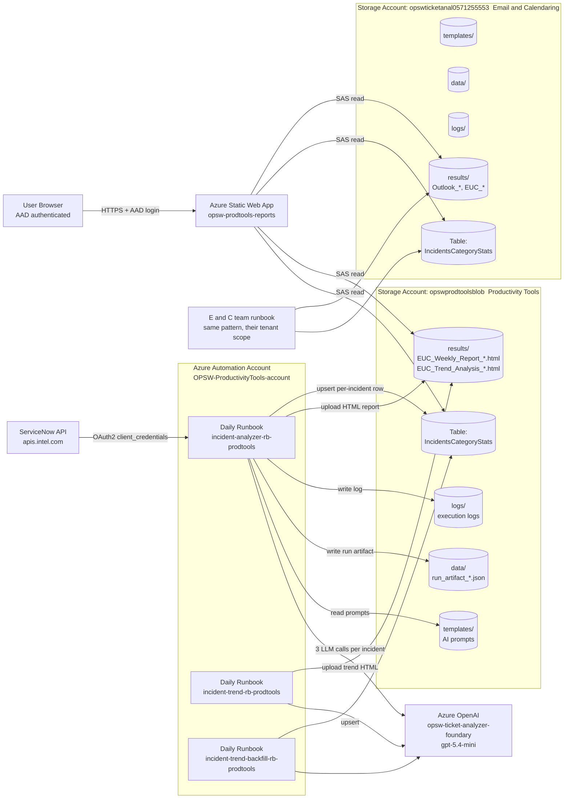
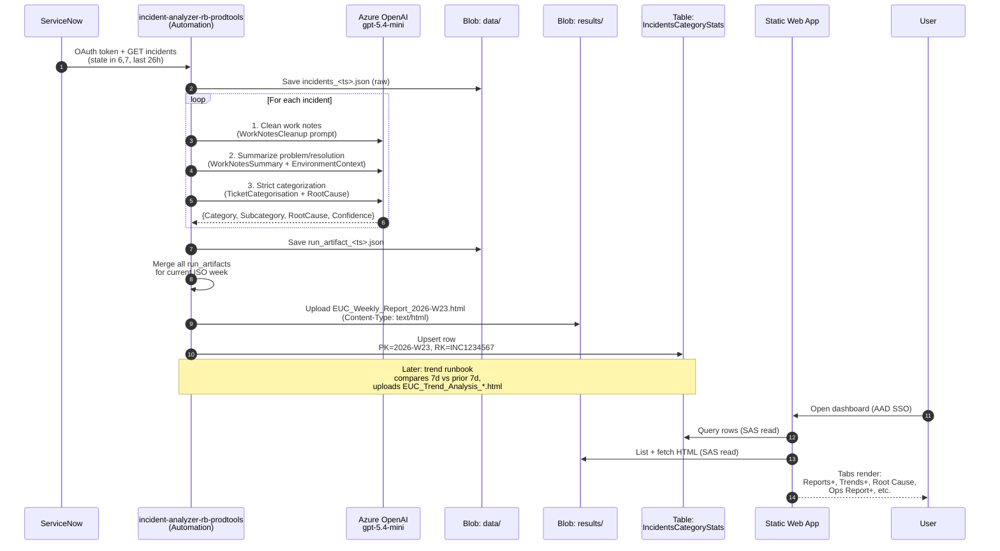

# AI-Powered Incident Analyzer for IT — Architecture

End-to-end Azure architecture showing how a single ServiceNow incident flows from ingestion to the user's browser.

---

## 1. High-Level Component Map



---

## 2. Single Incident Journey

Following one incident, `INC1234567` ("OneDrive sync fails on macOS"), from creation to dashboard card.



---

## 3. Azure Resource Inventory

| Layer | Resource | Name | Purpose |
|---|---|---|---|
| Identity | AAD App / Managed Identity | OPSW-ProductivityTools-account | Runbook auth to Storage + OpenAI |
| Compute | Automation Account | `OPSW-ProductivityTools-account` | Hosts PowerShell runbooks on a schedule |
| AI | Azure OpenAI | `opsw-ticket-analyzer-foundary` (model `gpt-5.4-mini`) | Cleanup, summary, categorization |
| Data (PT) | Storage Account | `opswprodtoolsblob` | Tables + blobs for Productivity Tools |
| Data (E and C) | Storage Account | `opswticketanal0571255553` | Tables + blobs for Email and Calendaring |
| Web | Static Web App | `opsw-prodtools-reports` | Dashboard frontend |
| External | ServiceNow REST API | `apis.intel.com/itsm/api/now/table/incident` | Source of incidents |

Resource Group: `OPSW-Ticket-Analyzer`

---

## 4. Runbooks (Scheduled Daily)

| Runbook | Schedule | Inputs | Outputs |
|---|---|---|---|
| `incident-analyzer-rb-prodtools` | Daily | `DailyLookbackHours=26` | `data/run_artifact_*.json`, `results/EUC_Weekly_Report_YYYY-Wxx.html`, table rows |
| `incident-trend-backfill-rb-prodtools` | Daily | `LookbackDays=2` | Table rows (only for incidents not yet stored) — idempotent |
| `incident-trend-rb-prodtools` | Daily (after analyzer) | None | `results/EUC_Trend_Analysis_YYYY-Wxx.html` |

---

## 5. AI Prompt Templates (Blob: `templates/`)

| Template | Used by | Purpose |
|---|---|---|
| `ProductivityTools_WorkNotesCleanup.md` | analyzer | Strip noise from worklog |
| `ProductivityTools_WorkNotesSummary.md` | analyzer | Concise problem + resolution summary |
| `ProductivityTools_EnvironmentContext.md` | analyzer | Domain knowledge bundled with other prompts |
| `ProductivityTools_TicketCategorisation.md` | analyzer | Strict category + subcategory assignment |
| `ProductivityTools_PossibleRootCause.md` | analyzer | Root cause taxonomy |
| `ProductivityTools_DetailedRootCause.md` | reference | Detailed RCA guide |
| `ProductivityTools_TrendSubCategorisation.md` | trend-backfill | Sub-category for trend drivers |

---

## 6. Frontend Read Path

```
User Browser
   │  HTTPS + AAD login
   ▼
Static Web App (opsw-prodtools-reports)
   │  reads web/config.json
   │  → tableSasToken (read-only, expires 2027-12-31 PT / 2028-06-03 E and C)
   │  → reportsSasToken (read-only, expires 2027-05-20 PT / 2028-06-04 E and C)
   ▼
Azure Storage (two accounts in parallel)
   ├─ Table API: IncidentsCategoryStats (Trends+, Root Cause, Ops Report+)
   └─ Blob API: results/*.html         (Reports+, Hero card, Quick preview)
```

---

## 7. What's Automated vs. Manual

- ✅ **Daily incident ingest, AI categorization, table write, weekly + trend HTML report** — automated for both services
- ✅ **Web dashboard updates** — purely read-driven, refreshes whenever the user reloads
- ⚠️ **SAS rotation** — manual before expiry (PT reports SAS 2027-05-20, PT table 2027-12-31, E and C reports 2028-06-04, E and C table 2028-06-03)
- ⚠️ **Blob `Content-Type=text/html`** — must be set at upload time by each runbook so reports render in-browser instead of downloading

---

## 8. Security Notes

- All runbook secrets (ServiceNow OAuth, Azure OpenAI key) live in **Azure Automation encrypted variables**
- Storage access from the SPA is **read-only via short-lived SAS tokens** scoped to specific containers/tables
- Static Web App is gated by **AAD/Entra authentication** — only signed-in users can reach the frontend
- E and C storage CORS allows both our SWA origin and their own SWA origin (additive — their app still works)
